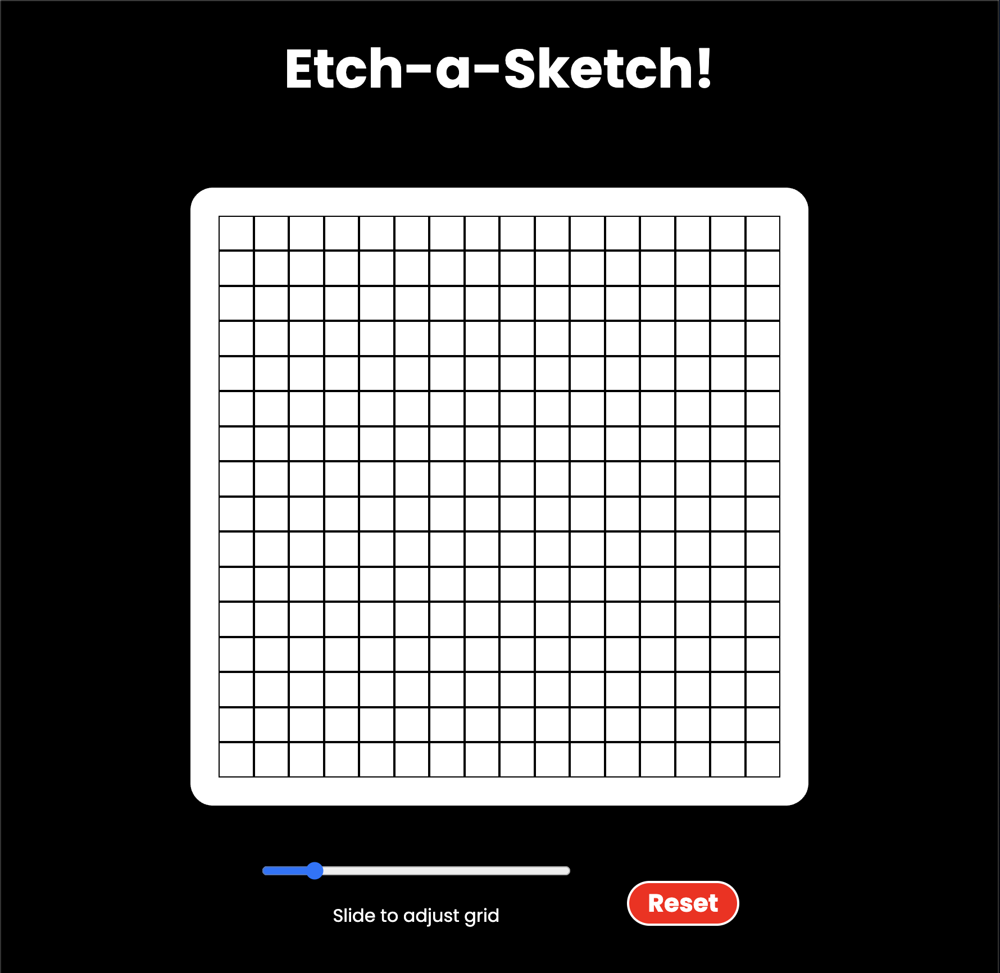

# Etch-a-Sketch 🎨

A simple browser-based Etch-a-Sketch game built with HTML, CSS, and JavaScript. Click and drag to draw, resize the grid, and experiment with random colors and opacity.

## 🚀 Try it out

[Play it here!](https://github.com/theamanali/etch-a-sketch)  


## ✨ Features

- Click and drag to color grid squares
- Random color generation and opacity increase
- Reset and resize the grid (up to 100x100)
- Responsive layout with Flexbox

## 🛠️ Installation

To run locally:

```bash
git clone https://github.com/your-username/etch-a-sketch.git
cd etch-a-sketch
open index.html
```

Or just open index.html in your browser!

## 🧰 Technologies Used
- HTML
- CSS (Flexbox)
- JavaScript (DOM, Events)

## 📄 License

This project is licensed under the MIT License.